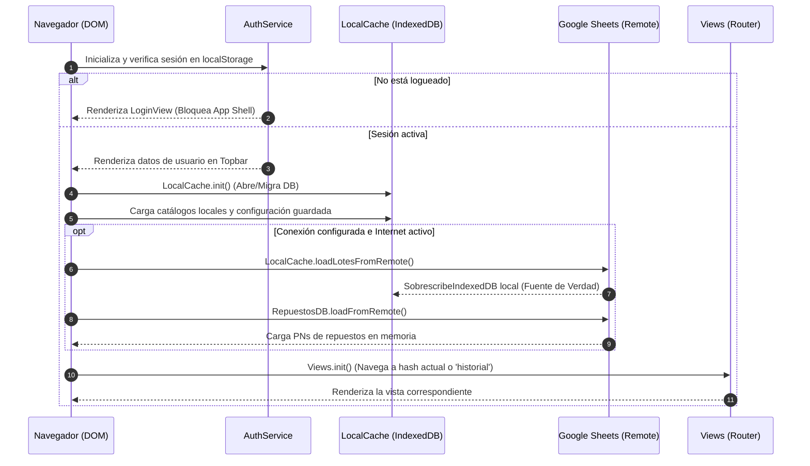
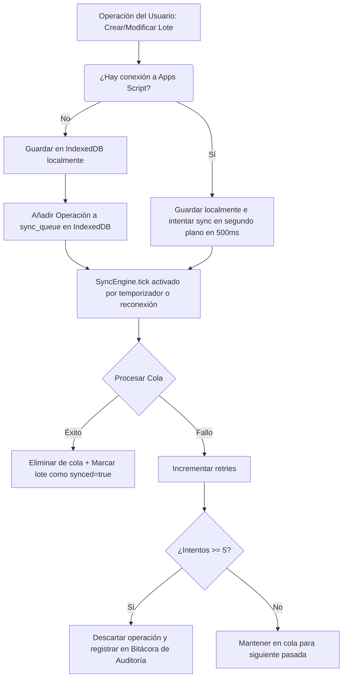

# ARCHITECTURE MAP & API REFERENCE — Inventario Pro v3.0.0

Este documento sirve como la guía técnica de referencia principal para desarrolladores y Agentes de IA. Contiene la estructura detallada del proyecto, la asignación de responsabilidades de cada módulo, la especificación de sus APIs y funciones, y los esquemas de datos clave de la aplicación.

---

## 📂 Estructura de Directorios y Archivos

```
c:\Users\Admin\Desktop\testa\
│
├── index.html                                        → Entrypoint principal. Carga CDNs y scripts en orden estricto de dependencias.
├── README.md                                         → Resumen del proyecto, requisitos y configuración.
├── ARCHITECTURE_MAP.md                               → Este documento (Gobernanza técnica y APIs).
├── AGENT_STATE_PLAN.md                               → Historial de fases de desarrollo e hitos.
├── version.json                                      → Control de versiones de la app para auto-update.
├── deploy.ps1                                        → Script en PowerShell para despliegue automatizado.
│
├── core-config/
│   ├── app.config.js                                 → Esquema de configuración global (columnas, estados, catálogos iniciales).
│   └── app.js                                        → Router (`Views.go()`) y orquestador del ciclo de vida (`DOMContentLoaded`).
│
├── core-theme/
│   ├── styles.css                                    → Estilos CSS globales, CSS variables, componentes UI, temas y estilos de impresión.
│   └── theme.js                                      → Administrador de temas oscuro/claro (`ThemeManager`).
│
├── modulo-0-datos/
│   ├── local-cache.js                                → IndexedDB wrapper (`LocalCache`/`LocalDB`). Maneja persistencia offline y caché.
│   ├── apps-script-bridge.js                         → Cliente HTTP para conectar con la API de Google Apps Script (Web App).
│   ├── sheets-api.js                                 → Integración lectura Google Sheets API v4.
│   ├── sync-engine.js                                → Motor offline-first para sincronización asíncrona de cola de operaciones.
│   ├── audit-trail.js                                → Historial de auditoría local e inmutable de operaciones.
│   ├── drive-upload.js                               → Convertidor de imágenes base64 a archivos físicos en Google Drive.
│   ├── import-export.js                              → Parser y exportador de archivos CSV y XLSX (SheetJS).
│   ├── lotes-service.js                              → Capa de servicio centralizada para operaciones de búsqueda y conteo de equipos.
│   ├── lote-portable.js                              → Serializador/deserializador de paquetes JSON (.json) con hash de integridad.
│   ├── repuestos-db.js                               → Base de datos compartida de Part Numbers de repuestos.
│   └── inventario.view.js                            → Vista de Inventario Completo con filtros avanzados y paginación.
│
├── modulo-1-ingreso/
│   ├── scanner-barras.js                             → Capturador de código de barras manual, auto y listener global de pistola física.
│   ├── evidencia-fotos.js                            → Manejador de carga de fotos, previsualizaciones en base64 y modal lightbox.
│   ├── flujo-garantia.js                             → Ciclo de vida y stepper de garantía (6 estados) con auditoría.
│   ├── flujo-soporte.js                              → Ciclo de vida y stepper de soporte técnico (6 estados) con cálculo de repuestos.
│   ├── modo-rapido.js                                → Panel flotante de configuración rápida para ingreso masivo de equipos.
│   ├── ingreso-tabla.js                              → Tabla interactiva de ingreso rápido en lote activo.
│   ├── ingreso-soporte-inline.js                     → Formulario en línea para gestionar repuestos y técnicos dentro del lote.
│   ├── ingreso-lote-modal.js                         → Ventana modal para creación y edición de metadatos de lotes.
│   ├── ingreso.view.js                               → Vista del panel de Ingreso & Diagnóstico.
│   └── historial.view.js                             → Vista de Historial de Lotes con buscador e importación/exportación de archivos.
│
├── modulo-2-reportes/
│   ├── reportes.view.js                              → Vista principal del generador de reportes.
│   ├── agrupador-lotes.js                            → Totalizador analítico de equipos para estadísticas y gráficos de progreso.
│   ├── print-window.js                               → Renderizador del iframe invisible para impresión limpia mediante `@media print`.
│   ├── tab-tickets-soporte.js                        → Controlador del tab de tickets de soporte técnico individual.
│   ├── tab-orden-compra.js                           → Controlador del tab de Orden de Compra consolidada de repuestos.
│   └── plantillas/
│       ├── garantia-proveedor.js                     → Generador HTML de plantilla formal para envío de garantía a proveedor.
│       ├── ticket-soporte.js                         → Generador HTML de ticket de soporte técnico individual.
│       └── reporte-lote.js                           → Generador HTML del resumen analítico del lote.
│
├── modulo-3-admin/
│   ├── admin.view.js                                 → Vista de panel de Administración de 6 pestañas.
│   ├── admin-conexion.js                             → Controlador de la pestaña de conexión (Sheets API y Apps Script).
│   ├── admin-repuestos-db.js                         → CRUD del catálogo local y remoto de repuestos.
│   ├── catalogos-crud.js                             → CRUD de catálogos generales (Marcas, Categorías, Sucursales, Proveedores).
│   ├── perfil-config.js                              → Importador/Exportador del perfil de configuración de la app en JSON.
│   └── pin-auth.js                                   → Teclado numérico y hashing SHA-256 para resguardo del panel de administración.
│
├── modulo-4-escaner/
│   └── escaner.view.js                               → Vista de búsqueda/ficha técnica de equipo mediante cámara WebRTC o manual.
│
├── modulo-5-usuarios/
│   ├── auth-service.js                               → Servicio central de autenticación de usuarios, roles y bloqueo temporal de fuerza bruta.
│   └── login.view.js                                 → Pantalla modal de login seguro que bloquea el App Shell.
│
├── componentes-ui/
│   └── modal-generico.js                             → Componente UI modal reutilizable con soporte para slots e inyección dinámica.
│
└── utils-helpers/
    ├── dom-helpers.js                                → Generador de strings HTML estandarizados (`DOM.card`, `DOM.emptyState`, etc.).
    ├── event-bus.js                                  → Bus de eventos global desacoplado (`EventBus.emit`, `EventBus.on`).
    ├── formatters.js                                 → Formateadores de fechas, badges de estado y strings de cobertura.
    ├── validators.js                                 → Validadores de entrada (RUC peruano, PIN de seguridad, requeridos).
    ├── toast.js                                      → Notificaciones emergentes no bloqueantes (success, error, info, warning).
    ├── image-utils.js                                → Compresor y optimizador de imágenes del lado del cliente.
    └── garantia-calculator.js                        → Lógica del cálculo de coberturas de garantía (6 meses) y soporte (3 años).
```

---

## 🔗 Registro de Namespaces Globales (`window`)

La aplicación expone objetos globales en el espacio de nombres de la ventana (`window`) para orquestar la comunicación. La tabla muestra la correspondencia de namespaces con archivos origen:

| Namespace en `window` | Archivo Origen | Descripción / Responsabilidad |
| :--- | :--- | :--- |
| **`APP_CONFIG`** | [app.config.js](file:///c:/Users/Admin/Desktop/testa/core-config/app.config.js) | Configuración de columnas, estados, tipos de equipos y credenciales en memoria. |
| **`Views`** | [app.js](file:///c:/Users/Admin/Desktop/testa/core-config/app.js) | Router SPA y control de la visibilidad de la barra lateral. |
| **`ThemeManager`** | [theme.js](file:///c:/Users/Admin/Desktop/testa/core-theme/theme.js) | Alternador del tema visual (`light-mode` / `dark-mode`). |
| **`Toast`** | [toast.js](file:///c:/Users/Admin/Desktop/testa/utils-helpers/toast.js) | Mensajes Toast emergentes no bloqueantes. |
| **`Formatters`** | [formatters.js](file:///c:/Users/Admin/Desktop/testa/utils-helpers/formatters.js) | Funciones auxiliares para visualización. |
| **`Validators`** | [validators.js](file:///c:/Users/Admin/Desktop/testa/utils-helpers/validators.js) | Comprobaciones formales de inputs. |
| **`EventBus`** | [event-bus.js](file:///c:/Users/Admin/Desktop/testa/utils-helpers/event-bus.js) | Mediador de mensajes (Publish/Subscribe). |
| **`DOM`** | [dom-helpers.js](file:///c:/Users/Admin/Desktop/testa/utils-helpers/dom-helpers.js) | Utilidades de renderizado y seguridad XSS. |
| **`LocalCache`** / **`LocalDB`** | [local-cache.js](file:///c:/Users/Admin/Desktop/testa/modulo-0-datos/local-cache.js) | Adaptador principal IndexedDB. |
| **`LotesService`** | [lotes-service.js](file:///c:/Users/Admin/Desktop/testa/modulo-0-datos/lotes-service.js) | Capa lógica de búsqueda y procesamiento cruzado de equipos en lotes. |
| **`LotePortable`** | [lote-portable.js](file:///c:/Users/Admin/Desktop/testa/modulo-0-datos/lote-portable.js) | Exportador/Importador de paquetes de lote JSON. |
| **`RepuestosDB`** | [repuestos-db.js](file:///c:/Users/Admin/Desktop/testa/modulo-0-datos/repuestos-db.js) | Base de datos interna de Part Numbers y autocompletado. |
| **`AppsScriptBridge`** | [apps-script-bridge.js](file:///c:/Users/Admin/Desktop/testa/modulo-0-datos/apps-script-bridge.js) | Interfaz REST hacia Google Web App. |
| **`SheetsAPI`** | [sheets-api.js](file:///c:/Users/Admin/Desktop/testa/modulo-0-datos/sheets-api.js) | Consultor de lectura direta de Google Sheets API v4. |
| **`SyncEngine`** | [sync-engine.js](file:///c:/Users/Admin/Desktop/testa/modulo-0-datos/sync-engine.js) | Orquestador de la cola de sincronización en segundo plano. |
| **`AuthService`** | [auth-service.js](file:///c:/Users/Admin/Desktop/testa/modulo-5-usuarios/auth-service.js) | Lógica de sesión, encriptación, control de accesos e intentos. |
| **`LoginView`** | [login.view.js](file:///c:/Users/Admin/Desktop/testa/modulo-5-usuarios/login.view.js) | Pantalla de inicio de sesión de la app. |
| **`IngresoView`** | [ingreso.view.js](file:///c:/Users/Admin/Desktop/testa/modulo-1-ingreso/ingreso.view.js) | UI y control del panel de ingreso y escaneo directo. |
| **`HistorialView`** | [historial.view.js](file:///c:/Users/Admin/Desktop/testa/modulo-1-ingreso/historial.view.js) | UI del historial y archivo de lotes. |
| **`InventarioView`** | [inventario.view.js](file:///c:/Users/Admin/Desktop/testa/modulo-0-datos/inventario.view.js) | UI de la tabla global de inventario. |
| **`ReportesView`** | [reportes.view.js](file:///c:/Users/Admin/Desktop/testa/modulo-2-reportes/reportes.view.js) | UI para generación de PDFs y XLSX. |
| **`AdminView`** | [admin.view.js](file:///c:/Users/Admin/Desktop/testa/modulo-3-admin/admin.view.js) | UI de administración del sistema. |
| **`EscanerView`** | [escaner.view.js](file:///c:/Users/Admin/Desktop/testa/modulo-4-escaner/escaner.view.js) | UI de la ficha técnica y activación de cámara WebRTC. |
| **`ModalGenerico`** | [modal-generico.js](file:///c:/Users/Admin/Desktop/testa/componentes-ui/modal-generico.js) | Orquestador del cuadro de diálogo global. |

---

## 📊 Diagramas de Secuencia e Integración

### 1. Ciclo de Inicialización (Bootstrap de la Aplicación)
Este flujo ocurre en [app.js](file:///c:/Users/Admin/Desktop/testa/core-config/app.js) durante el evento `DOMContentLoaded`.



### 2. Motor de Sincronización Offline-First (SyncEngine)
El mecanismo que permite trabajar sin conexión y sincroniza los cambios con Google Sheets asíncronamente.



---

## 🛠️ Especificación Detallada de APIs y Funciones

### `LocalCache` (o `LocalDB`)
Encargado de la base de datos local IndexedDB (`inventario-pro-v2`).

*   **`async init()`**: Inicializa IndexedDB, crea stores (`equipos`, `lotes`, `audit`, `sync_queue`, `config`, `catalogos`, `repuestos_db`). Realiza la migración de lotes antiguos a `admin` si no poseen owner.
*   **`async getConfig(key, defaultVal)`**: Recupera una preferencia de configuración local.
*   **`async setConfig(key, value)`**: Almacena una preferencia localmente.
*   **`async getCatalogos()`**: Obtiene los catálogos en memoria y los mezcla con `APP_CONFIG.catalogos`.
*   **`async setCatalogo(key, value)`**: Almacena y actualiza un catálogo (ej: marcas).
*   **`async getLotes()`**: Devuelve el arreglo completo de lotes locales.
*   **`async getLoteActivo()`**: Devuelve el lote que tiene `activo: true`.
*   **`async crearLote(titulo, tecnico)`**: Desactiva lotes anteriores, crea uno nuevo asignando el `_ownerId` del usuario actual, lo persiste e inicia la sincronización.
*   **`async updateLote(lote)`**: Actualiza el lote en IndexedDB, marcándolo con `synced: false` para disparar el motor de sync.
*   **`async deleteLote(loteId)`**: Borra el lote localmente y añade el ID a la lista de `deleted_lote_ids` para prevenir que vuelva a descargarse de Sheets en futuras sincronizaciones.
*   **`async continuarLote(loteId)`**: Activa el lote especificado y desactiva todos los demás.
*   **`async agregarEquipoALote(loteId, equipo, obsPersonal)`**: Añade un equipo al lote en primer lugar. Asigna `_timestamp` y `_registroId` únicos.
*   **`async eliminarEquipoDeLote(loteId, registroId)`**: Remueve el equipo especificado del lote.
*   **`async loadLotesFromRemote()`**: Descarga los lotes desde Google Sheets (mediante `AppsScriptBridge`), los filtra contra los eliminados locales (`deleted_lote_ids`), limpia el store local y guarda la nueva información.
*   **`async syncCatalogTiposFromLotes(lotes)`**: Examina todos los repuestos colocados en los lotes y agrega los nuevos al catálogo automáticamente para prevenir catálogos vacíos.

---

### `RepuestosDB`
Gestiona la correspondencia de repuestos con sus respectivos números de parte (Part Numbers) de forma local y remota.

*   **`async loadFromRemote()`**: Descarga los Part Numbers desde la pestaña `_RepuestosDB` en Sheets y los almacena en IndexedDB y en un mapa de memoria en caché (`Map()`).
*   **`async guardarPN(repuesto, modelo, pn)`**: Guarda la relación en IndexedDB, incrementa el contador de usos de ese modelo para ese repuesto y dispara la sincronización asíncrona a Sheets tras 3 segundos.
*   **`buscarPN(repuesto, modelo)`**: Devuelve el Part Number exacto. En caso de no existir, realiza una búsqueda por similitud de texto sobre el modelo para recomendar el PN más idóneo en base a su frecuencia de uso.
*   **`getSugerenciasPN(repuesto)`**: Devuelve una lista de todos los Part Numbers disponibles para una categoría específica.
*   **`async eliminarEntrada(key, modeloToRemove)`**: Remueve un modelo o una entrada completa de la base de datos local y remota.
*   **`async editarPN(key, modelo, nuevoPn)`**: Actualiza el Part Number de un modelo determinado.

---

### `LotesService`
Capa de lógica centralizada que resuelve la redundancia de buscar y manipular equipos que están dispersos en múltiples lotes.

*   **`async findEquipo(registroId)`**: Devuelve el objeto `{ equipo, lote }` buscando recursivamente en la estructura interna de todos los lotes.
*   **`async updateEquipo(registroId, updateFn)`**: Modifica el equipo in-place mediante el callback `updateFn`, añade la marca de fecha de última modificación, guarda el lote emitiendo el evento `equipo:updated`.
*   **`async findEquipos(filterFn)`**: Recupera todos los equipos de la base que coincidan con la función de filtrado.
*   **`async findEnLotesPorCodigo(codigoOSerie)`**: Busca el historial de un dispositivo a través de su Código de Inventario o Número de Serie en todos los lotes locales.
*   **`contarPorEstado(lote)`**: Retorna un resumen cuantitativo de los equipos dentro de un lote (Ej: `{ total: 10, C: 8, P: 1, M: 1 }`).

---

### `AuthService`
Orquestador de seguridad de la aplicación con prevención de ataques por fuerza bruta.

*   **`async login(username, password)`**: Autentica al usuario validando el hash SHA-256 de su contraseña contra el diccionario `USERS` local. En caso de éxito, crea un token ofuscado en Base64 con validez de 12 horas.
*   **`logout()`**: Borra la sesión en localStorage y realiza un refresco total de la página para destruir variables en memoria.
*   **`isLoggedIn()`**: Determina si existe una sesión activa y vigente.
*   **`isAdmin()`**: Devuelve `true` si el rol del usuario actual es `admin`.
*   **`canEditLote(lote)`**: Regla de autorización multiusuario. Devuelve `true` si el usuario es `admin` o si es un `tecnico` y su nombre coincide con el campo `_ownerId` del lote.

---

### `SyncEngine`
Manejador offline-first de sincronización.

*   **`start()`**: Inicia el timer de sincronización asíncrona cada 30 segundos (configurable) y registra el listener de red `'online'` en el navegador para sincronizar al recuperar Internet.
*   **`async enqueue(action, payload)`**: Encola una transacción en `sync_queue` para procesarla después.
*   **`async syncWrite(sheetName, rowData, auditInfo)`**: Escribe una línea en la base de datos remota e inyecta la correspondiente entrada en el log de auditoría remota de manera simultánea.
*   **`async forceSync()`**: Ejecuta un ciclo de sincronización de la cola de forma inmediata.

---

### `LotePortable`
Módulo de serialización que permite la portabilidad de los datos de un lote entre PCs.

*   **`async exportar(loteId, opciones)`**: Prepara un objeto JSON con metadatos de la empresa, versión, estadísticas internas y un hash SHA-256 de integridad calculado sobre los equipos del lote. Descarga el archivo automáticamente.
*   **`async importar(file)`**: Lee un archivo JSON, valida su firma, recalcula el hash de integridad, genera nuevos identificadores únicos para los registros importados y persiste el lote resultante en IndexedDB.

---

### `SheetsAPI`
Adaptador de lectura directa de Google Sheets a través de API REST.

*   **`init(sheetsConfig)`**: Configura la API con la clave API, ID de la hoja de cálculo y el nombre de la pestaña principal.
*   **`async fetchAll()`**: Descarga todo el set de datos de equipos de la hoja. Implementa una caché de 30 segundos en memoria para evitar llamadas duplicadas.
*   **`async findByCodigoOSerie(query)`**: Busca y devuelve un único equipo por coincidencia exacta con su número de serie o código de inventario.

---

### `AppsScriptBridge`
Mapeador de peticiones HTTP POST hacia Google Apps Script (Web App) para las tareas de escritura y manejo de archivos.

*   **`init(webAppUrl)`**: Registra la URL del Web App desplegado en Apps Script.
*   **`async saveLotes(lotes)`**: Envía el payload completo de lotes locales al Apps Script para ser archivado.
*   **`async uploadToDrive(base64, filename, mimeType)`**: Transmite una imagen base64 para guardarla en una carpeta de Google Drive, retornando el ID del archivo y su enlace de visualización pública.
*   **`async writeRow(sheetName, rowData)`**: Añade una fila al final de la pestaña especificada en Sheets.

---

## 📝 Esquemas de Datos Clave

### 1. Esquema de Lote (`lotes` store)
Representa un grupo o lote de equipos procesados por un técnico.
```typescript
interface Lote {
  id: string;               // Ej: "lote_1714243950000"
  titulo: string;           // Ej: "LOTE 101 - INGRESO WAYRA"
  tecnico: string;          // Nombre del técnico asignado en UI (opcional)
  _ownerId: string;         // Creador del lote (ej: "admin", "tecnico1")
  fechaCreacion: string;    // ISO timestamp (Ej: "2026-06-18T16:46:08.000Z")
  fechaCierre?: string;     // ISO timestamp si el lote fue completado
  activo: boolean;          // Indica si es el lote seleccionado actualmente en UI
  synced: boolean;          // Control de estado de sincronización local
  equipos: Equipo[];        // Listado de equipos que componen este lote
}
```

### 2. Esquema de Equipo (`Equipo` dentro de un lote)
Combina los campos provenientes del catálogo maestro de Sheets con variables de auditoría y diagnóstico local.
```typescript
interface Equipo {
  // --- Campos Importados de la Ficha Maestra ---
  SERIE: string;            // Número de serie física del equipo
  CODIGO: string;           // Código interno de inventario
  TIP_EQUIP: string;        // LAPTOP, PC, AIO, MONITOR, etc.
  MARCA: string;            // DELL, HP, LENOVO, etc.
  MODELO: string;           // Modelo detallado
  PROCESADOR: string;       // Detalle del CPU
  RAM: string;              // Capacidad RAM
  HD_SSD: string;           // Capacidad Almacenamiento
  PULGADAS?: string;        // Tamaño de pantalla (si aplica)
  SUCURSAL: string;         // Sucursal de procedencia
  ESTADO: "C" | "P" | "M" | "V" | "G" | "S"; // Letra del estado actual del equipo
  OBSERVACION?: string;     // Notas del catálogo general
  FEC_COMPRA?: string;      // Fecha adquisición (para cálculo de garantía)
  DOC_COMPRA?: string;      // Enlace a factura o nombre de documento de compra

  // --- Campos Locales y Flujos de Diagnóstico ---
  _registroId: string;      // ID único generado en el cliente (Ej: "reg_1714243980000")
  _timestamp: string;       // ISO fecha de agregado al lote
  _obsPersonal?: string;    // Observaciones adicionales redactadas por el técnico
  _addedAt?: string;        // ISO timestamp de ingreso
  
  // --- Flujo Garantía (si ESTADO = "G") ---
  _estadoGarantia?: string; // RECIBIDO, DIAGNOSTICADO, ENVIADO_PROVEEDOR, etc.
  _historialGarantia?: Array<{
    estado: string;
    fecha: string;
    comentario: string;
    usuario: string;
  }>;

  // --- Flujo Soporte Técnico (si ESTADO = "S") ---
  _estadoSoporte?: string;  // RECIBIDO, DIAGNOSTICO, ESPERANDO_REPUESTO, LISTO, etc.
  _tecnicoAsignado?: string;// Nombre del técnico a cargo de la reparación
  _repuestosUsados?: Array<{
    repuesto: string;       // Tipo de repuesto (Ej: "PANTALLA")
    pn: string;             // Part Number asociado
    comentario?: string;    // Observaciones del repuesto
  }>;
  
  // --- Multimedia ---
  _fotos?: Array<{
    nombre: string;         // Nombre del archivo
    url: string;            // URL de visualización en Google Drive
    thumbUrl?: string;      // URL de miniatura
    fileId: string;         // ID del archivo en Google Drive
    timestamp: string;      // Fecha de subida
    preview?: string;       // Miniatura local base64 de respaldo
  }>;
}
```

### 3. Registro de Repuesto (`repuestos_db` store)
La estructura utilizada en el buscador rápido y diccionario de Part Numbers.
```typescript
interface RepuestoDBEntry {
  key: string;              // Combinación "repuesto|modelo_normalizado"
  repuesto: string;         // Ej: "PANTALLA"
  pn: string;               // Part Number principal (más usado)
  updatedAt: string;        // Fecha última modificación
  modelos: Array<{
    modelo: string;         // Nombre original del modelo (Ej: "Latitude 3420")
    pn: string;             // Part Number específico
    usos: number;           // Contador de asignaciones
  }>;
}
```

---

## 📣 Reglas de Gobernanza para IAs
Si eres una IA editando este repositorio, sigue estas directrices estrictas:
1.  **Preserva las API Globales**: No alteres los nombres de los objetos globales ni quites los alias como `window.LocalDB = LocalCache`.
2.  **Modularidad CSS**: Todo el diseño visual reside en [styles.css](file:///c:/Users/Admin/Desktop/testa/core-theme/styles.css) mediante variables CSS. Evita agregar estilos inline extensos.
3.  **Comunicaciones Desacopladas**: Utiliza [event-bus.js](file:///c:/Users/Admin/Desktop/testa/utils-helpers/event-bus.js) (`EventBus`) para notificar cambios entre módulos. No llames métodos de vistas de un módulo desde otro directamente.
4.  **No Modificar dependencias CDN**: Mantén las librerías cargadas en [index.html](file:///c:/Users/Admin/Desktop/testa/index.html) sin empaquetadores (Vite/Webpack) a menos que el usuario lo solicite.
